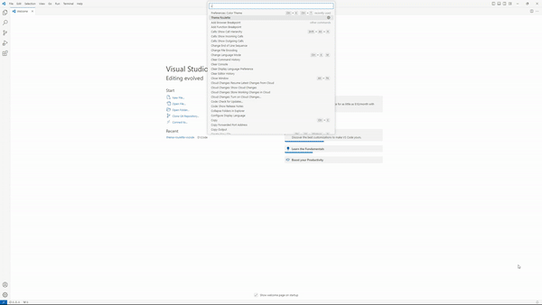

# Theme Roulette

## Features
This plugin adds a `Theme Roulette` command which picks a random theme and applies it.

## Extension Settings

* `themeroulette.includeDefaults`: Include the default Visual Studio Code themes when picking a random theme.
